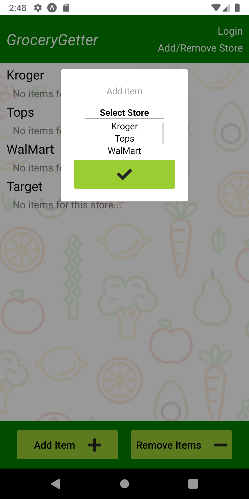

# GroceryGetter

Android application for creating a grocery list (or any shopping list) and organizing the items by store. Front end built with React Native. User's list is saved via persistent local data storage.

&nbsp;&nbsp;&nbsp;&nbsp;&nbsp;&nbsp;

Made specifically for how my wife and I grocery shop. We are in a small town with only a few stores and we know what each store carries. So all we need is to know is what to get from each store!

[Visit the live snack.](https://snack.expo.dev/@stevehoneck/github.com-stevehoneck-grocerygetter)
In the "Preview" pane, select "Android" and click "Tap to play".

Future updates:
- Implement React-Redux.
- Build server and database. Allow multiple users to access the same list.

